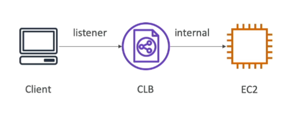
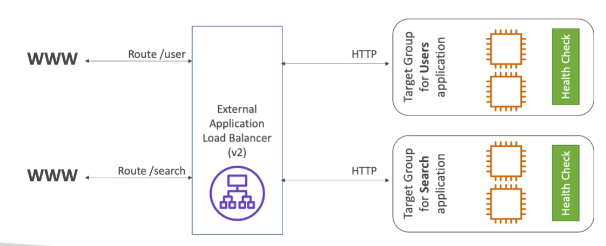
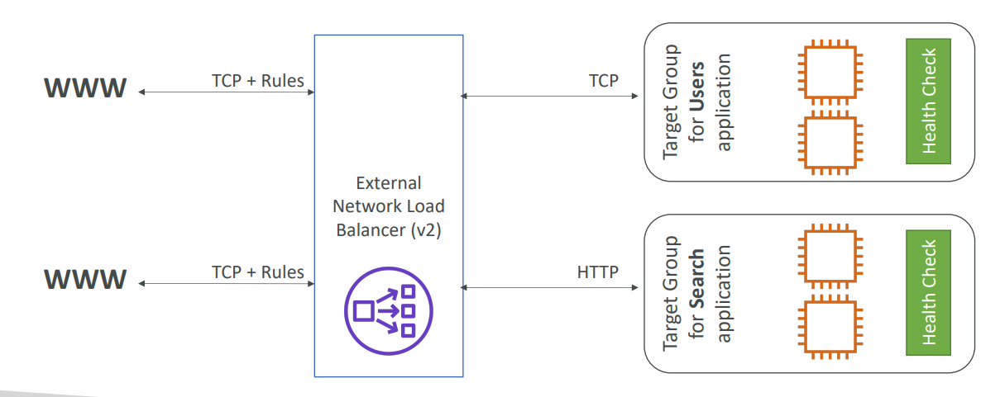
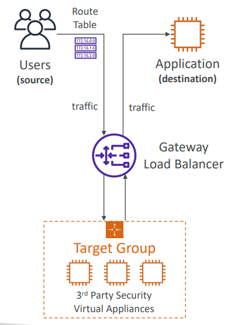
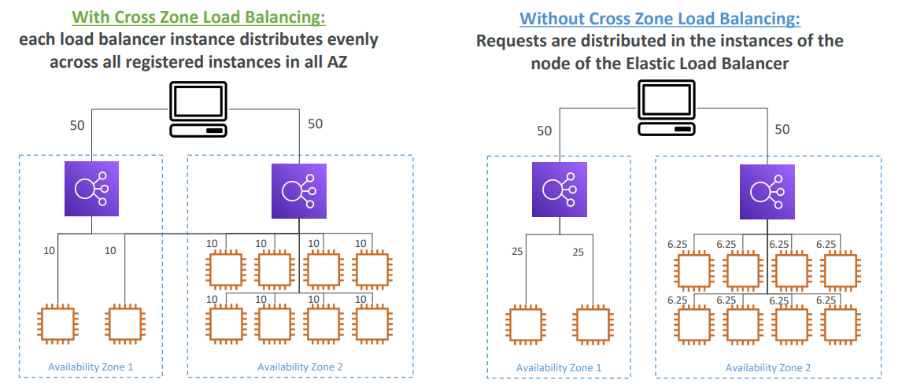
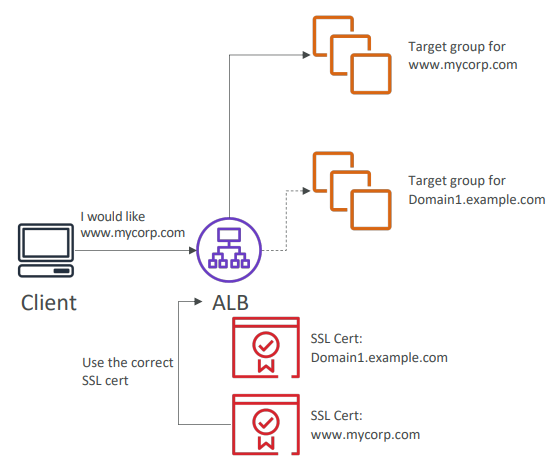

# Availability and Scalability

Scalability means that an application or system can handle greater loads by adapting.
There are two kinds of scalability: vertical and horizontal.
- Vertical scalability means increasing the size pof the instance.
- Horizontal means increasing the number of instances.

Availability - means that your system stays available in different situations. Usually it means that your app runs in two or more data centers (availability zones).

In AWS we reach:
- vertical scalability - by increasing the size of instance
- horizontal scalability - by **Auto Scaling Group** and **Load Balancer**
- high availability - by **Auto Scaling Group** and **Load Balancer**

# ELB
Load balancer it is special server's application that forward traffic to multiple application servers downstream. There are a lot of benefits using load balancer:
- spread load across multiple downstream instances
- expose a single point of access (DNS) to your application
- seamlessly handle failures of downstream instances (for example, redirects user queries to other instances)
- do regular health checks to your instances
- provide ssl termination (HTTPS) for your websites (when user ends session or time for current session expires, ssl token should be terminated, load balancer does it)
- enforce stickiness with cookies (stickiness means that all queries from one user will be redirected to that one server to which first query was sended (session sticks to the server))
- high availability across zones
- it can separate public traffic for private

**Why use AWS ELB:**
- ELB is a managed load balancer - it means that:
  - AWS guarantees that it will be working
  - AWS takes care of upgrades maintenance, high availability
  - AWS provides only a few configuration knobs (all the insides will be done by AWS)
- It can costs less to setup your own load balancer but, also, it can turn into a nightmare
- AWS ELB integrated with many AWS offerings / services
  - EC2, EC2 Auto Scaling Groups, Amazon ECS
  - AWS Certificate Manager (ACM), CloudWatch
  - Route 53, AWS WAF, AWS Global Accelerator

AWS ELB provides heals checks. It is done on a port and a route made for it (/health is common). If the response is not 200 then the instance is unhealthy.

With AWS ELB we also can control access. We do it with the help of Load Balancer Security Groups. For example we can allow http and https inbound traffic for load balancer from outside. But for EC2 instance we will allow http and https traffic inbound traffic only from load balancer, that means that all traffic should go through load balancer (you will not have direct access to instance with http and https protocols).

## Types of load balancer on AWS
AWS has 4 generations of managed load balancers:
- Classic Load Balancer (v1 - old generation, considered obsolete) - from 2009: HTTP, HTTPS, TCP, SSL (secure TCP)
- Application Load Balancer (v2 - new generation) - from 2016: HTTP, HTTPS, WebSocket
- Network Load Balancer (v2 - new generation) - from 2017: TCP, TLS (secure TCP), UDP
- Gateway Load Balancer - from 2020: operates at layer 3 (network layer) - Ip Protocol

### CLB
Supports layer 4 and 7, can provide health checks and have fixed hostname.

### ALB
Supports layer 7. But it can balancing to multiple HTTP applications across machines and to multiple application on the same machine. For this we use **target groups** - there is no such feature in CLB, because it is previous generation. It's great for balancing micro-services and containers.
- supports http/2 and websocket
- support redirects
- we can make routing to multiple target group and this routing based on: path in URL (ex.com/users & ex.com/search), hostname in url (one.ex.com & other.ex.com), query string and headers (ex.com/users?id=123&order=false) - in comparison, we'd need multiple CLB per application, so target groups are great.
- has a port mapping feature to redirect on dynamic port in ECS
- health check are at the target group level
- has fixed hostname (similar to XXX.region.elb.amazonaws.com)
- application server don't see the IP of the client directly (true ip of client is inserted in the header X-Forwarded-For, we can also get port and proto from headers - X-Forwarded-Port and X-Forwarded-Proto)

Target groups can be based on:
- EC2 instances (can be managed by Auto Scaling Group) - HTTP
- ESC tasks (managed by ECS itself) - HTTP
- Lambda functions - HTTP request in translated into a JSON event
- IP Addresses - must be private IPs

### NLB
Supports level 4 and allows forward tcp and udp traffic to your instances. it can handle millions of request per second and has less latency (about 100ms) then ALB (about 400ms). NLB has one static IP per AZ, and supports assigning Elastic IP (helpful for whitelisting specific IP). If we need extreme performance, then it's our variant. But it's not included to AWS free tier.

Target groups can be based on:
- EC2 instances
- IP Addresses (private IPs)
- Application load balancer

### GWLB
It operates on 3 layer of OSI - handle IP Packets. And it combines Transparent Network Gateway and load balancer. It means, that besides balancing we could pass our traffic through some additional levels. For example we pass it through first target group, then send to a second one. It can be helpful if we want, for example, to check our traffic (in Firewall or IDPS). It uses GENEVE protocol on port 6081.

Target group can based on:
- EC2 instances
- IP Addresses

# Load balancer's features

## Sticky sessions (sessions affinity)
Stickiness means that the same client is always redirected to the same instance.
- You can make stickiness for CLB and ALB.
- Stickiness is achieved with the help of cookies.
- Cookies have an expiration date you can control.
- Enabling stickiness may bring imbalance to the load over the backend EC2 instances.

### Stickiness cookie's types
- Duration-based cookies - cookies are generated by the load balancer, and cookie name for ALB is AWSALB, and for CLB is AWSELB. There we shouldn't think about how at all.
- Application-based cookies - cookies must be generated by application, duration also should be under application control. In settings we should identify custom name of the cookie, that our application generates, and set the same duration. Load balancer gets this cookie, then he do some manipulations with it, and send his own cookie to the client, so there we have two cookies: first one our custom cookie, for the load balancer, and second, client's cookie, for the client, with the name AWSALBAPP-Number (there can be set of cookies 0,1,2...) - it generates by load balancer.

Main difference between them, that with duration-based cookies we don't think about cookie's generating.

## Cross-Zone Load Balancing
All requests are distributed equally between all instances across all availability zones.

## Load Balancer SSL/TLS Certificates

An SSL Certificates allows your traffic to be encrypted between client and load balancer. SSL refers to Secure Sockets Layer, TLS refers to Transport Layer Security. Nowadays TLS mainly used, but people steal refer as SSL (usually use term SSL instead of TLS). Public SSL are issued by CA (special organizations) and have an expiration date (you set) and must be renewed.

- Load balancer uses X.509 certificates (SSL/TLS server certificate)
- You can manage certificates using ACM (AWS Certificate Manager)
- You can create and upload your own certificates alternatively
- HTTPS listener: you must specify a default certificate; you can add an optional list of certs to support multiple domains; clients can use SNI (Server Name Indication) to specify the hostname they reach; ability to specify a security policy to support older versions of SSL/TLS (legacy clients)

### Server Name Indication
It solves the problem of loading multiple SSL certificates onto one web server (to serve multiple websites). It's a newer protocol and requires the client to indicate the hostname of the target server in the initial SSL handshake. The server will then find correct certificate, or return the default one. It works for ALB and NLB, and for CloudFront, but not for CLB.

### Load Balancer Version's SSL Support

- CLB: support only one SSL certificate (because there is no target groups and routing rules)
- ALB: supports multiple listeners with multiple SSL certificates and uses SNI to make it works
- NLB: supports multiple listeners with multiple SSL certificates and uses SNI to make it works

## Connection Draining
Connection draining it's time to complete request. It's called so in the CLB, in newer versions of LB it's called De-reregistration Delay. The idea of this is that if some EC2 Instance marked as unhealthy or being in state of de-registering, then new requests will not be sent to that instance, but old connections will not be terminated until delay-time ends. For AWS this time is between 1 and 3600 seconds (default is 300). It can be disabled (set value to 0).

# Auto Scaling Groups
ASG is a possibility to increase or decrease the number of instance depends on load. If the load is increased then we add instances, if it is decreased then we remove instances. We the help of ASG we can also re-create EC2 instances if something goes wrong with someone. In AWS with the help of ASG we can even automatically register/deregister instances to load balancer. And what's more, ASG are FREE (you only pay for the underlying EC2 instances).

### ASG Settings
When we configure the ASG in AWS, we need configure next things:
- Minimum, desired and maximum capacity.
- Set load balancer and load balancer's target group for autoscaling (if needed).
- Create and set launch template.
- Set scaling policies.

### Launch template
Set of different EC2 service's parts, templated from some created objects:
- AMI + Instance Type
- EC2 User Data
- EBS Volumes
- Security Groups
- SSH Key Pair
- IAM Roles for EC2 Instances
- Network + Subnet Information
- Load Balancer Information
- ...

## Scaling policies

One more cool thing of ASG is the wide possibility to create different rules for automatic scaling. We can create policies depends on different metrics (for example Average CPU or request number), we also can use CloudWatch alarms for policies. Some metrics can be computed for the overall ASG, and we can increase or decrease number of instances depends on alarm. We can make scheduled policies. And we can even use some prediction models for increasing\decreasing instance's number.

### Policy's groups
Commonly we have two groups of policies:
- Dynamic Scaling Policies
  - Target Tracking Scaling: it's most simple to set-up, for example, to stay average CPU around 40%
  - Simple \ Step Scaling: there u add steps for different triggers, for example:
    - if CloudWatch alarm is triggered for CPU > 70% the add 2 instance
    - if CloudWatch alarm is triggered for CPU < 30% the remove 1 instance
  - Scheduled Actions: anticipate scaling based on known usage patterns, for example, increase capacity to 10 at 5 pm on Friday. 
- Predictive Scaling - it when you add\delete instances based on load's metric prediction

### Different metrics to use
- CRUUtilization
- RequestCountPerTarget
- Average Network In / Out
- Other custom metrics, for example, common request delay...

### Scaling cooldown
One more thing to know about ASG is scaling cooldown. It's period of time between scaling activities. If some scaling activity happens the cooldown allowing next starts. If another scaling trigger worked before cooldown ends, activity will not be started before it end. The default cooldown period is 300 seconds.